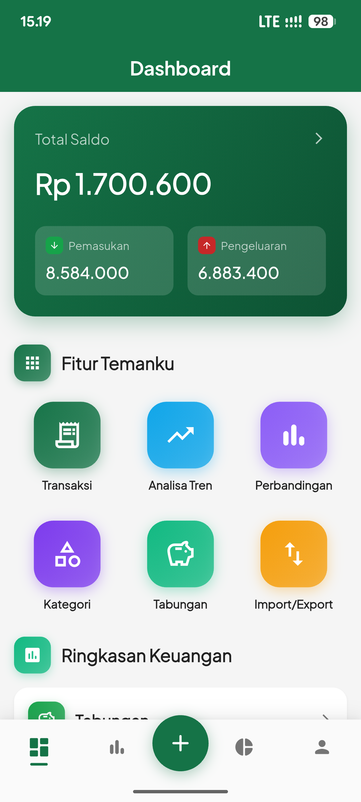
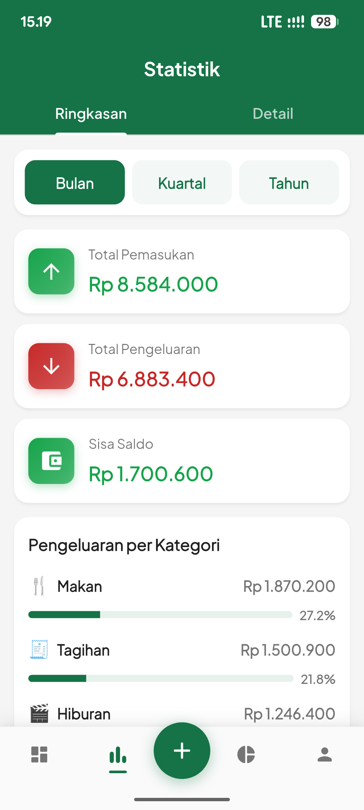
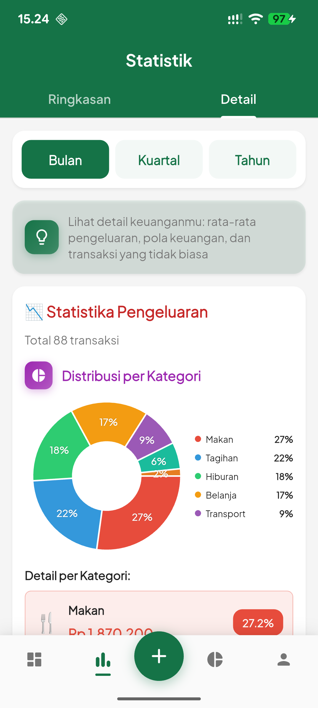
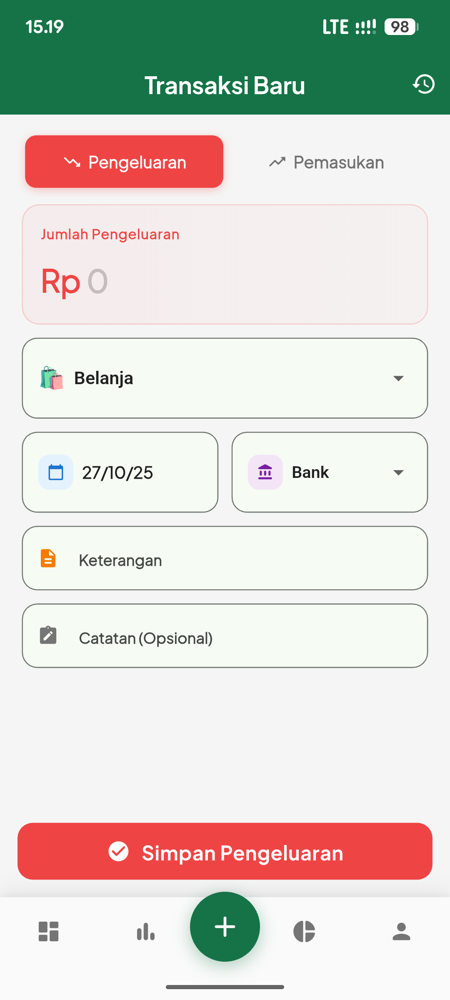
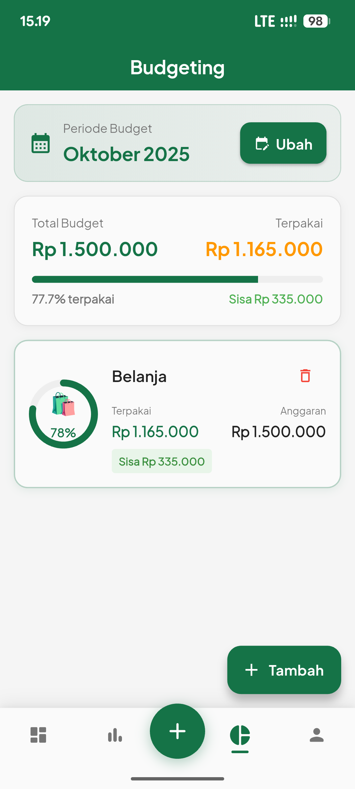
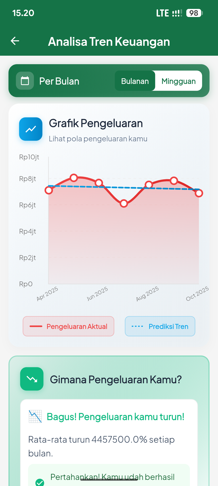
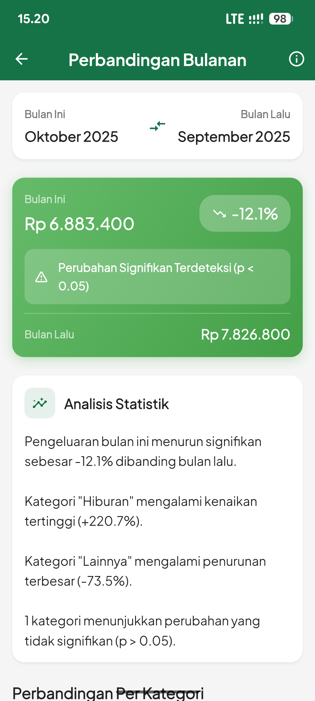
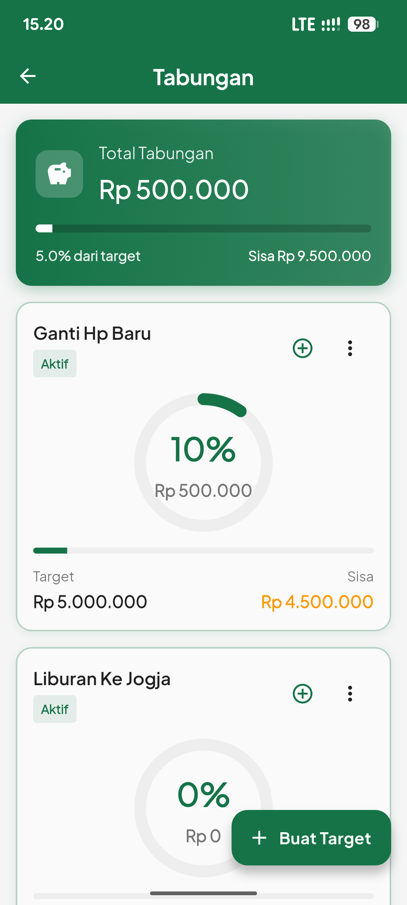

# Temanku Mobile 📱

Teman kecil yang bantu jagain keuanganmu

## 📖 Deskripsi

Temanku adalah aplikasi manajemen keuangan pribadi yang membantu Anda melacak pengeluaran, pemasukan, dan mengelola budget dengan mudah dan intuitif.

## ✨ Fitur

- 📊 **Dashboard Interaktif** - Visualisasi keuangan dengan grafik dan chart
- 💰 **Transaksi** - Catat pemasukan dan pengeluaran dengan mudah
- 🏷️ **Kategori** - Kelola kategori transaksi sesuai kebutuhan
- 🏦 **Akun** - Kelola berbagai akun seperti cash, bank, e-wallet
- 💳 **Transfer Antar Akun** - Transfer dana antar akun dengan mudah
- 🎯 **Budget** - Atur budget per kategori dengan monitoring real-time
- 💎 **Tabungan** - Catat dan monitor target tabungan
- 📈 **Riwayat** - Lihat riwayat transaksi lengkap dengan filter
- � **Statistik** - Analisa keuangan dengan berbagai chart dan insight
- 📈 **Trend Analysis** - Analisa tren keuangan dengan prediksi AI
  - Grafik line chart dengan trend prediction
  - Mode bulanan dan mingguan
  - Correlation analysis income vs expense
  - Statistical insights (mean, std dev, etc)
- 🔄 **Monthly Comparison** - Bandingkan pengeluaran 2 bulan dengan uji hipotesis statistik
- �📤 **Import/Export** - Import dan export data dalam format CSV
- 🔐 **Autentikasi** - Login dengan email/password atau Google Sign-In
- 🔄 **Reset Data** - Hapus semua data dengan verifikasi 2 langkah
- 🌙 **Dark Mode** - Support mode gelap (coming soon)

## 🚀 Getting Started

### Prerequisites

- Flutter SDK (3.9.2 atau lebih tinggi)
- Dart SDK (3.9.2 atau lebih tinggi)
- Android Studio / VS Code
- Android SDK (untuk build Android)
- Xcode (untuk build iOS - Mac only)

### Installation

1. Clone repository ini:

```bash
git clone https://github.com/diopratama99/temanku.git
```

2. Install dependencies:

```bash
flutter pub get
```

3. Generate launcher icons:

```bash
dart run flutter_launcher_icons
```

4. Generate splash screen:

```bash
dart run flutter_native_splash:create
```

5. Run aplikasi:

```bash
flutter run
```

## 🏗️ Build

### Android APK

```bash
flutter build apk --release
```

### Android App Bundle

```bash
flutter build appbundle --release
```

### iOS

```bash
flutter build ios --release
```

## 📦 Tech Stack

- **Framework**: Flutter 3.9.2+
- **State Management**: Provider
- **Database**: SQLite (sqflite)
- **Charts**: fl_chart
- **Statistical Analysis**: Custom implementation (Linear Regression, Hypothesis Testing)
- **Authentication**: Google Sign-In
- **File Handling**: file_picker, share_plus
- **Image Handling**: image_picker
- **Icons**: flutter_launcher_icons
- **Splash Screen**: flutter_native_splash
- **Fonts**: Google Fonts
- **Number Formatting**: intl (Indonesian locale)

## 📱 Screenshots

### 🏠 Dashboard


### 📊 Statistik Ringkasan


### 📈 Statistik Detail


### ➕ Add Transaction


### 💰 Budgeting


### 📉 Analisa Tren Keuangan


### 🔄 Perbandingan Bulanan


### 🏦 Tabungan


## 🗂️ Struktur Project

```
lib/
├── main.dart                 # Entry point aplikasi
├── data/
│   └── app_database.dart    # Database helper & models
├── pages/
│   ├── home_page.dart       # Home with bottom navigation
│   ├── dashboard_page.dart  # Dashboard overview
│   ├── login_page.dart      # Login & Register
│   ├── add_transaction_page.dart  # Add transaction form
│   ├── transactions_page.dart     # Transaction history
│   ├── categories_page.dart       # Category management
│   ├── account_transfers_page.dart # Account transfers
│   ├── budgets_page.dart          # Budget planning
│   ├── savings_page.dart          # Savings goals
│   ├── statistics_page.dart       # Charts & analytics
│   ├── trend_analysis_page.dart   # Trend analysis with AI prediction
│   ├── monthly_comparison_page.dart # Monthly expense comparison
│   ├── profile_page.dart          # User profile
│   └── import_export_page.dart    # Import/Export data
├── services/
│   └── auth_service.dart    # Authentication service
├── state/
│   └── auth_notifier.dart   # Authentication state
├── theme/
│   └── app_theme.dart       # Theme configuration
├── utils/
│   ├── snackbar_utils.dart  # Snackbar helpers
│   └── trend_analysis.dart  # Statistical analysis utilities
└── widgets/
    ├── app_bottom_navigation.dart
    ├── balance_card.dart
    ├── form_fields.dart
    ├── main_navigation_scaffold.dart
    ├── state_widgets.dart
    └── transaction_list_item.dart
```

## 🔧 Configuration

### Google Sign-In

Untuk menggunakan fitur Google Sign-In, Anda perlu:

1. Setup project di [Google Cloud Console](https://console.cloud.google.com/)
2. Enable Google Sign-In API
3. Konfigurasi OAuth 2.0 credentials
4. Update `android/app/google-services.json` (Android)
5. Update `ios/Runner/GoogleService-Info.plist` (iOS)

### Database

Aplikasi menggunakan SQLite untuk penyimpanan lokal. Database akan otomatis dibuat saat pertama kali aplikasi dijalankan.

## 👨‍💻 Development

### Run in Debug Mode

```bash
flutter run
```

### Run Tests

```bash
flutter test
```

### Analyze Code

```bash
flutter analyze
```

### Format Code

```bash
flutter format .
```

## 📝 License

Copyright © 2025 Temanku. All rights reserved.

## 👤 Author

**Dio Pratama**

- GitHub: [@diopratama99](https://github.com/diopratama99)

## 🤝 Contributing

Contributions, issues and feature requests are welcome!

## ⭐ Show your support

Give a ⭐️ if this project helped you!

---

Made with ❤️ using Flutter
